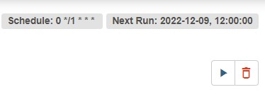
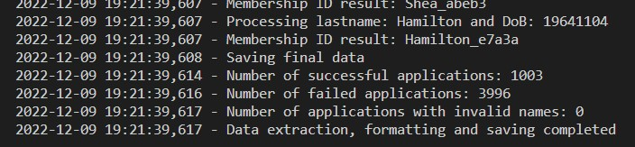

## Overview

To process datasets and separate them into valid, invalid and invalidnames applications datasets.  

### **Data:**
* applications_dataset_1.csv and applications_dataset_2.csv from [Senior-DE-Tech-Challenge](https://github.com/ameeraadam/Senior-DE-Tech-Challenge)

### **Mock Dataset Columns:**
* name
* email
* date_of_birth
* mobile_no

### **Cleaned Dataset Columns:**
* member_id
* name
* first_name
* last_name
* above_18
* age
* date_of_birth
* mobile
* email

### **Usage:**
* Navigate to the section-1-data-pipelines folder
    * `/de-tech-challenge/section-1-data-pipelines`
    * Run `python ./src/main.py` to generate the final datasets
    * Run `pytest ./tests/unit_tests.py --cov-report html:./tests/results --cov=src` to generate the coverage and pytest results
        * Navigate to `./tests/results/index.html` to view the results

### **Scheduling:**
* Using crontab to schedule a cronjob with `0 */1 * * * python ./src/main.py`
* Airflow can also be used (Dag can be found at /de-tech-challenge\section-1-data-pipelines/src/airflow/dags/process_data.py)  

### **Results:**
* Successful applications: 1003
* Invalid applications: 3996
* Invalid names applications: 0

### **Assumptions:**
* Log messages will be displayed on the terminal

### **Comments:**
* Jupyter notebook was used to develop the code and the finalized version copied to .py files
* I had issues getting the logging function to save into log files hence, logs are emitted to the terminal
* Experienced issues getting Airlow to work locally, screenshot was sourced from deployment in AWS Managed Airflow (Paths in Dag are not adjusted to AWS)

### **Reference:**
* https://airflow.apache.org/docs/apache-airflow/stable/howto/docker-compose/index.html
