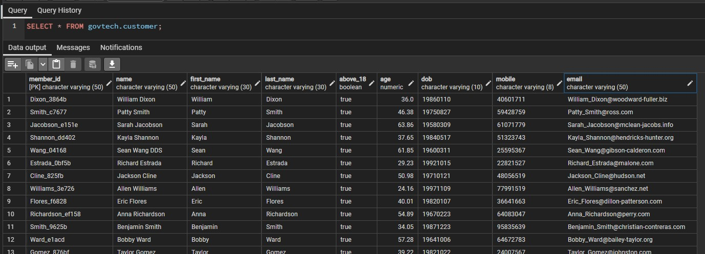
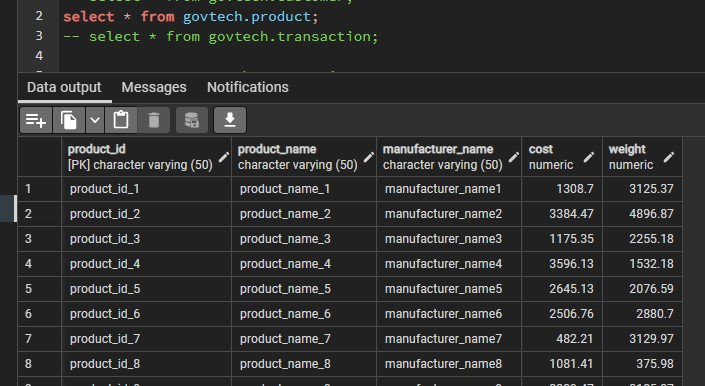
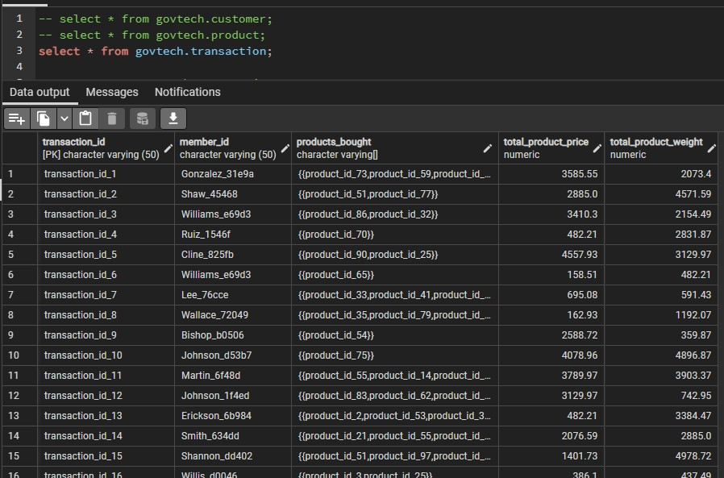
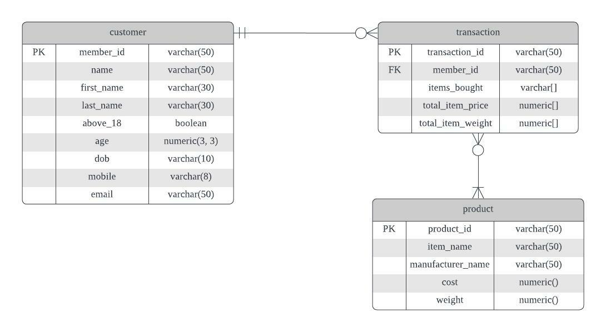
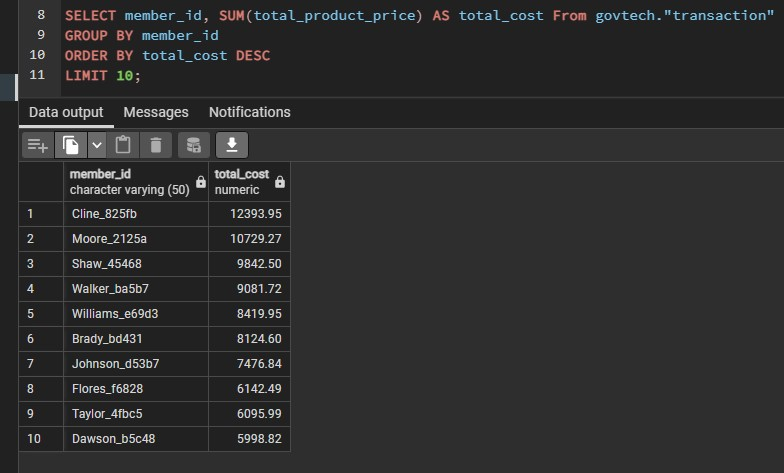
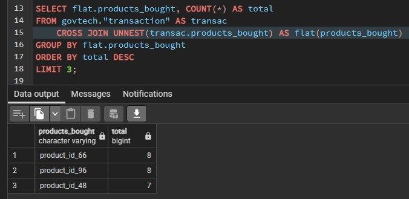

## Overview

The Docker image is built via the Dockerfile which uses the [provided](https://hub.docker.com/_/postgres) Postgres image.  
src folder is also copied into the image.

Within the image, `initsql.sql` is copied to the `/docker-entrypoint-initdb.d/` folder.
This allows Postgres to execute SQL statements upon startup.

Indexes are also created for the Primary Keys of the tables as they are expected to be the most commonly queried.

The indexes are reference/pointers of the defined columns, allowing for queries to quickly and efficiently lookup desired values and retrived them from the tables as compared to looking through the whole table for the results without them.

`initsql.sql` does the following:
1. Create the `govtech` user
2. Create the `govtech` database
3. Create the `govtech` schema
4. Create the `product` table
5. Create the `customer` table
6. Create the `transaction` table
7. Copies the included valid applications data into the `customer` table
8. Creates indexes for the `product`, `customer` and `transaction` tables

Jupyter notebook is used to insert mock data into the `product` and `transaction` tables.  
In production, APIs or applications should act as middleware to process and verify the sales & purchases before inserting the records into the `transaction` table.

### **Sample Queries:**




### **ERD**


### **Usage:**
* Navigate to the section-2-databases folder
* Navigate to the src folder
    * Build and run the Docker image:
        * `docker build -t postgres-local .`
        * `docker run -d --name postgres-local -e POSTGRES_PASSWORD=postgres -p 5432:5432 postgres-local`

### **Query answers:**
```sql
SELECT member_id, SUM(total_product_price) AS total_cost From govtech."transaction"
GROUP BY member_id
ORDER BY total_cost DESC
LIMIT 10;
```


```sql
SELECT flat.products_bought, COUNT(*) AS total
FROM govtech."transaction" AS transac
    CROSS JOIN UNNEST(transac.products_bought) AS flat(products_bought)
GROUP BY flat.products_bought
ORDER BY total DESC
LIMIT 3;
```


### **Tools:**
* pgAdmin: To access Postgres
* Jupyter notebook: To insert mock data into the tables

### **Docker:**
* docker container ls
* docker logs postgres-local
* docker container stop postgres-local
* docker container rm postgres-local
* docker rmi postgres-local
