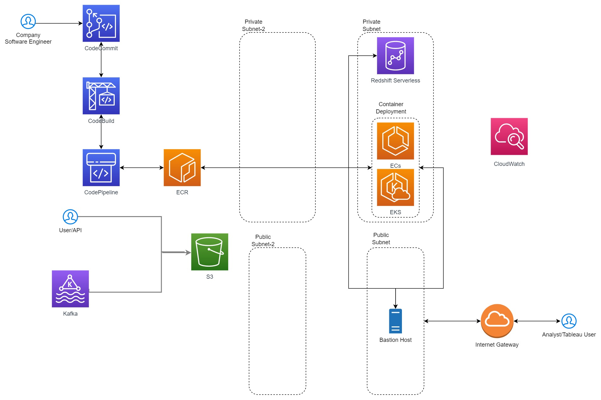

## **Overview**

Repository contains the replies for System-Design-1 and System-Design-2.

#### **System-Design-1:**
Details the thought process for the database access strategy.

#### **System-Design-1:**
Details the AWS system architecture for the described scenario/use cases.  
A detailed explaination of the architecture is also provided for review.  
Below is an image of the architecture.
(Architecture)

References:
* https://stackoverflow.com/questions/29437650/how-can-i-ensure-that-a-materialized-view-is-always-up-to-date
* https://aws.amazon.com/blogs/devops/multi-branch-codepipeline-strategy-with-event-driven-architecture/