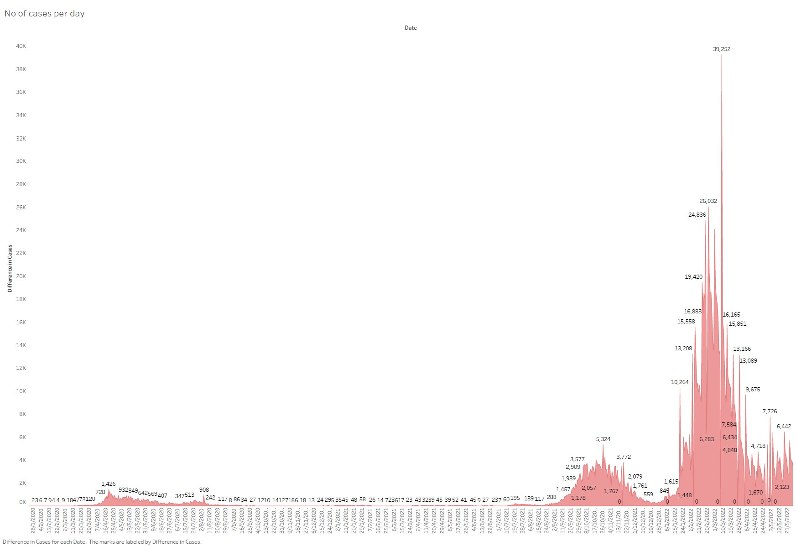

Overview

* Uses `./src/get_data.py` to query the API and save the results as as json file
* Data is then imported into Tableau for visualizing
* Included pdf, workbook (Located in the **src** folder) and screenshot (Located in the **images** folder) of the dashboard

