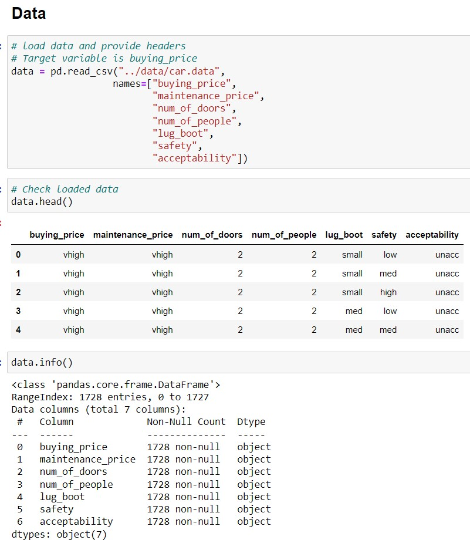
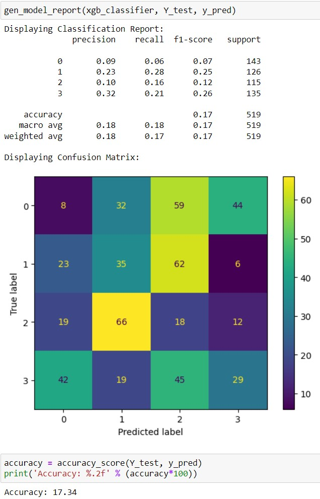
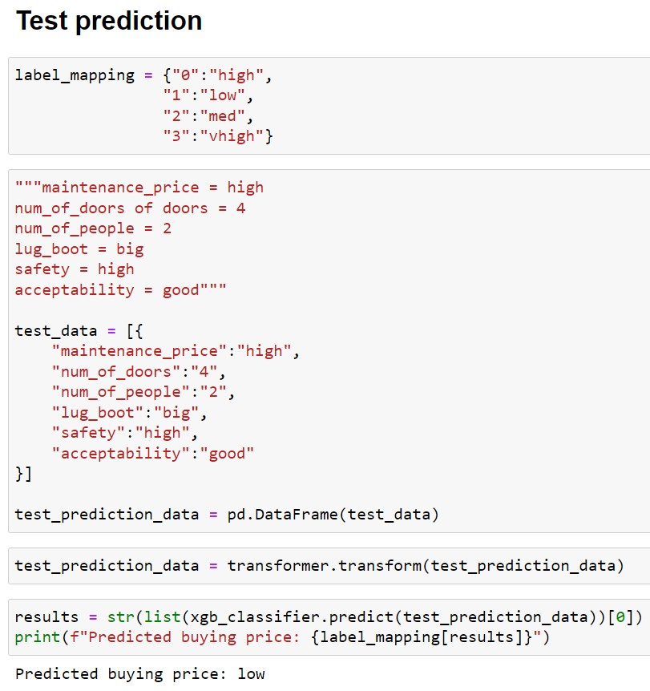

## Overview

Multi-class Classification problem.  
Trains a XGBoost model to make the predictions.  

### **Dataset:**
* 6 features; `buying`, `maint`, `doors`, `persons`, `lug_boot` and `safety`
* 1 target variable: `unacc`
* As the section requested to predict the buying price, I've opted to set `unacc` as a feature and `buying` as the target variable.
* Features are all categorical.


### **Modelling:**
* An initial baseline XGBoost model is trained on the provided data without hyperparameters searching.
* Determine optimal set of hyperparameters using Grid Search with a list of defined search parameters.
* The best model from the Grid Search is then compared with against the baseline (Accuracy and F1-Score).
* A prediction is then made using the model and input data.

### **Results:**



### **Assumptions:**
* Class value is assumed to be acceptability.
* The provided test data has only 5 columns.
* I've opted to include the missing `Number of persons` feature with a value from the dataset.
* All values in the test data are also changed to lowercase.
```
Maintenance = High
Number of doors = 4
Lug Boot Size = Big
Safety = High
Class Value = Good
```